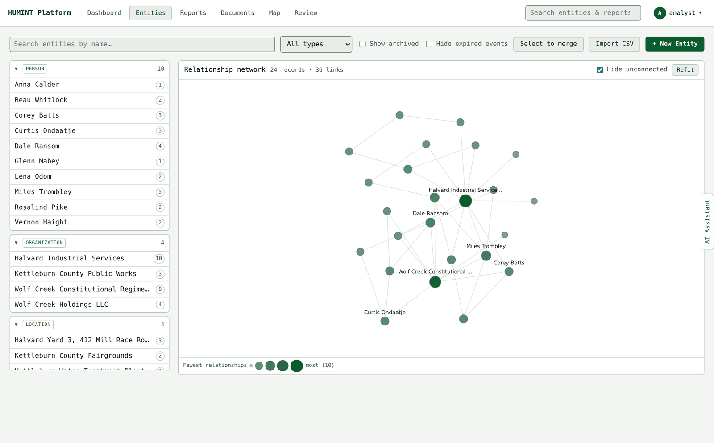
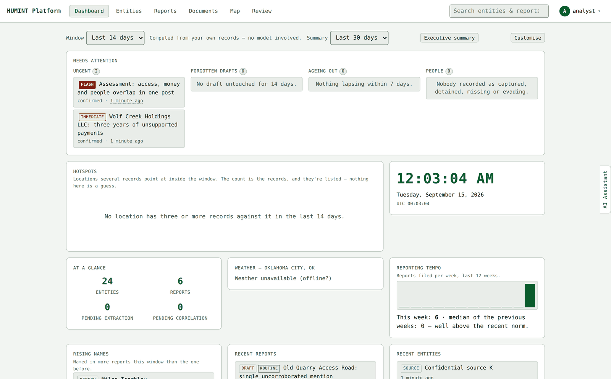
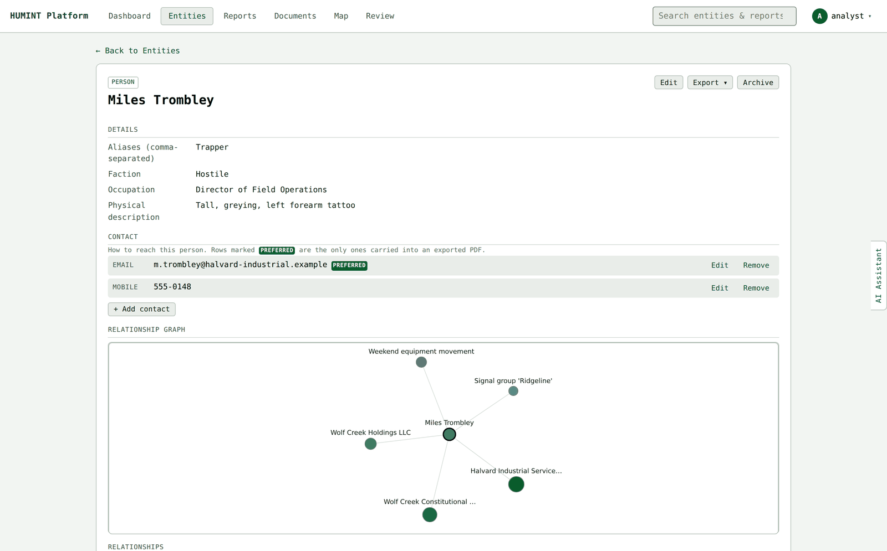
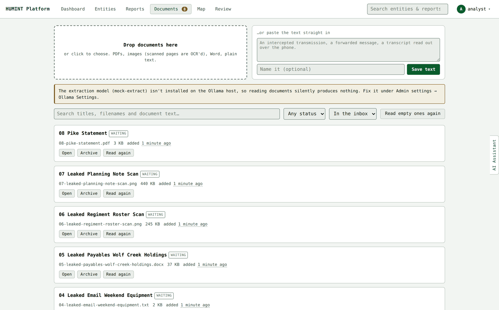
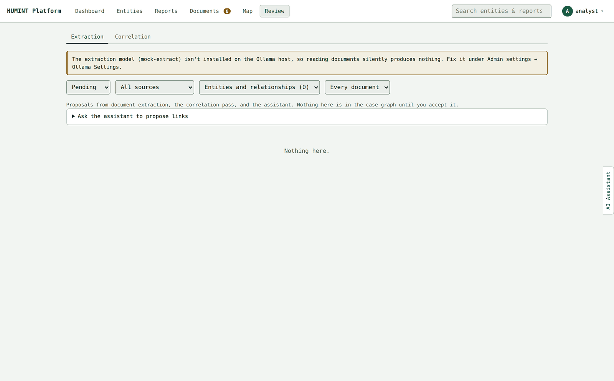

# HUMINT Platform

A self-hosted case-management platform for human-source and open-source
intelligence work. Record people, organizations, locations, events, sources, communications, vehicles and documents; write reports and link them to what they
discuss; drop in documents and let a **local** model propose the entities and
relationships it finds — for you to accept or throw out.

OpenCTI was the inspiration, not the model. This is a smaller and narrower
thing, built around HUMINT case work rather than cyber threat intelligence —
no STIX bundles, no observables. People, places, organizations, and the
reports and relationships that tie them together.

**Everything runs on your hardware.** Postgres, the API, the worker and —
if you want extraction — Ollama, all in Docker Compose on one machine. No
account, no cloud service, no telemetry. It is comfortable on a Raspberry Pi
4 without the model, and wants more memory with one.

> **Beta.** This is being tested by a small group. It works, it is tested
> (66 automated suites, API and browser), and it is not yet something to
> stake a real operation on. See [Deliberate limitations](docs/DESIGN.md#deliberate-limitations-read-before-relying-on-this-for-anything-important).



---

## Quick start

You need Docker and Docker Compose. Nothing else.

```bash
git clone https://github.com/xPirate/Humint-platform.git
cd Humint-platform
cp .env.example .env
# Open .env and set POSTGRES_PASSWORD to something real.
docker compose up -d --build
```

Open `http://localhost:8080`. The first screen asks you to create the admin
account — there are no default credentials, and the first account made is the
admin.

That is the whole install. The step-by-step version, including running it on
a Pi, putting it behind HTTPS, and turning on the optional model, is
[SOP 01 — Install and first run](docs/sop/01-install.md).

## What it does

**Eight kinds of entity.** Person, Organization, Location, Event, Source,
Communication, Vehicle and Record — each with fields that actually belong to it (a
Person's aliases and disposition, a Source's A–F reliability rating, a
Location's address and auto-geocoded coordinates, a Vehicle's make, plate and
body style, a Record's full text). Not a generic "object" with a bag of key/values.

**Documents that become part of the case.** An uploaded letter, statement or
registration printout can be saved as a **Record**: an entity holding the
document's full text, linked to the people and places it mentions, with the
original file attached. It sits on the network and on every linked page like
anything else.

**Alignment on the things that take sides.** People, organizations, sources
and vehicles carry Friendly / Neutral / Unknown / Hostile. A named group is an
entity of its own, so an individual aligned Friendly can belong to an
organization aligned Hostile — and a source can be Hostile and still grade A,
because whose side they are on and how good their reporting is are different
questions. Locations get an environment instead: permissive through denied,
because ground does not take a side.

**A network you can arrange.** Drag any dot in the relationship network and
it stays where you put it while the rest makes room; double-click to release
it, Refit to start over. The layout keeps drifting gently after it settles, and
stops when the tab is hidden or the pane is off screen.

**A click on a dot answers "who is that?"** — a card beside it with the type,
the alias, the alignment, the fields that identify that kind of record and the
nearest connections. Open the record from the card when you want it; reading
the shape of the file no longer costs two page loads per question.

**Right-click any record.** A menu of what to do about it: ask the assistant
about it, have the model look for links it might have, find records that read
like it (aliases, second files on the same person), add a relationship, start a
report, export a dossier. The model-backed items grey out with a reason when
Ollama is off.

**Relationships you can argue with.** Every link carries a confidence —
possible, probable, confirmed — a discovery date and notes, all editable in
place. Nothing the machine proposes arrives as anything better than
*possible*.

**Reports that point at records.** Write a report, @-mention the entities it
discusses, and the link is made both ways. Reports carry a credibility rating
and a precedence (Flash / Immediate / Priority / Routine), and export to PDF
on their own or as a package with everything they reference.

**A document inbox.** Drop in a PDF, image, `.docx` or text file. The worker
OCRs it if it needs OCR, then — if you have a model — proposes the entities
and relationships it found. Every proposal lands in a review queue with the
evidence attached. Nothing is written to the case file until you say so.

**Two review queues, no autopilot.** Extraction proposes records from
documents; correlation proposes that two records are the same thing. Both
are queues of suggestions with a reason you can check, never automatic
writes.

**Merging.** Five copies of one person, or an address split into a street, a
town and a postcode, fold into one record. Everything that pointed at the
losers points at the survivor; the losers are archived with a pointer to
where they went, so old exports and audit entries still resolve.

**A relationship network.** The whole case file as a picture, with the dots
graded by how many relationships each record has, so the thing everything
points at is obvious. Drawn by the app itself — no CDN, works offline.

**Records from the document you are reading.** The model misses things — a
byline, a company named once in passing. Select the name in the document text
and record it there, with the sentence it came from kept as evidence.

**Maps that work with the network unplugged.** Register a tile source, drag a
box over the ground you care about, and download it while you still have a
connection. After that the map is served from your own machine. ATAK map
source files import directly, satellite imagery included. Leaflet is served by
the app, not a CDN, so the map always loads.

**Zones, like a NOTAM.** Draw an area, say how workable it is, and put a clock
on it. A protest that turns from semi-permissive to non-permissive is one edit
and a note saying why — kept as a timeline, not an overwrite. When the clock
runs out the zone dims rather than vanishing, and the reports written while it
was running stay gathered under its Event.

**A place a source can point at.** In a guided debrief, somebody who cannot
give you an address can very often point at the roof. The pin becomes a
Location record — with real coordinates — when the report is filed, and
nothing at all if the debrief is abandoned.

**An audit trail.** Every write, who did it and from where, with optional
syslog forwarding. Whole-instance backup and restore as a single zip. Admins
can delete noise permanently, previewed and audited; everyone else archives.

**A local model, optionally.** Point it at an Ollama instance — the bundled
container or one you already run — and it does extraction, embeddings for
duplicate detection, and an assistant that can only see your case file.
Without a model, everything except extraction still works, and the signal
pass still proposes links using plain SQL over what you have entered.

## Screens

| | |
|---|---|
|  **Dashboard** — what needs attention, computed from your own records, no model involved. |  **A record** — its details, contacts, neighbourhood and every report that mentions it. |
|  **Documents** — the inbox: drop a file in, see what was pulled out of it. |  **Review** — suggestions with their evidence, filtered by kind and source. |

*Every name, place, company and phone number in these screenshots is
invented. They are from the training exercise that ships with the
project — see [the exercise briefing](docs/exercise/BRIEFING.md).*

## Documentation

| | |
|---|---|
| [SOP 01 — Install and first run](docs/sop/01-install.md) | Get it running, on a laptop or a Pi. Includes the optional model, HTTPS and first-login checks. |
| [SOP 02 — Daily analyst use](docs/sop/02-daily-use.md) | The working loop: document in, suggestions reviewed, duplicates merged, report out. |
| [SOP 03 — Admin and maintenance](docs/sop/03-admin.md) | Backups, restore, upgrading between builds, users, and what to do when something misbehaves. |
| [Design notes](docs/DESIGN.md) | The long-form reference: what everything does and why it works that way. Read it when you want to know the reasoning, not the steps. |

## Requirements

|  | Without a model | With a local model |
|---|---|---|
| CPU | 2 cores | 4+ cores |
| RAM | 2 GB | 8 GB for a 7–8B model, more for larger |
| Disk | 5 GB + your attachments | 5 GB + the model (4–40 GB) |
| Tested on | Raspberry Pi 4 (8 GB), x86 Linux, macOS | x86 Linux with and without a GPU |

The model does not need a GPU. It is slower without one, and nothing in the
app waits on it — extraction runs in a background worker, never on the
request path.

## Security, briefly

This is built to run on a network you control, and it assumes that. Sessions
are cookie-based, passwords are hashed, every write is audited, and uploads
are handled carefully — but **there is no multi-tenancy and no per-record
access control**. Everyone with an account sees the whole case file. Put it
behind a VPN or a reverse proxy with TLS, not on the open internet.

Full posture, including what is deliberately not defended against, is in
[the design notes](docs/DESIGN.md#security-posture).

## Reporting problems

Open an issue. Useful ones include what you did, what happened, what you
expected, and the relevant lines from `docker compose logs api` or
`docker compose logs worker`.

**Scrub your case data first.** Log lines and screenshots from a real file
contain real names. If the bug needs data to reproduce, please reproduce it
with invented data — the exercise set in `docs/exercise/` is there for
exactly this.

## Licence

[AGPL-3.0](LICENSE). In short: you can run, modify and redistribute this
freely, and if you run a modified version as a network service, the people
using it are entitled to your changes. If that is a problem for your
situation, get advice from someone qualified to give it — this note is not
legal advice.
